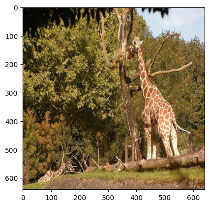
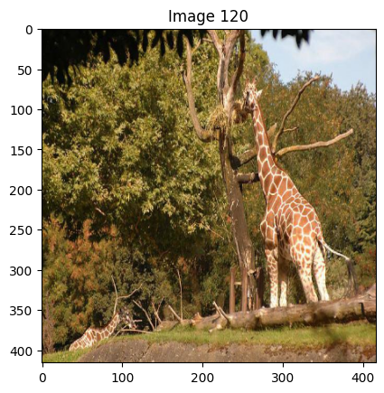
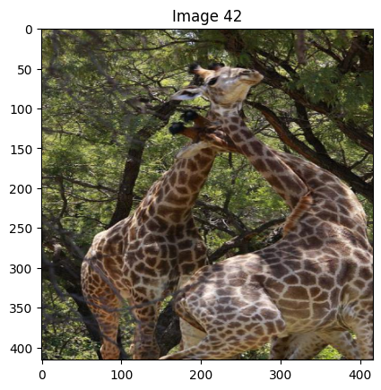
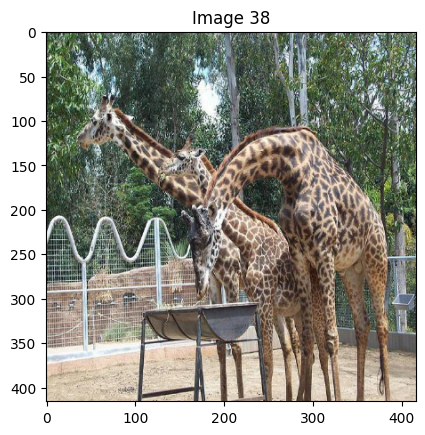
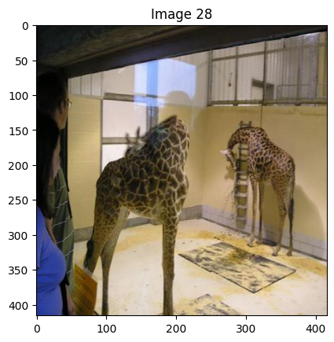
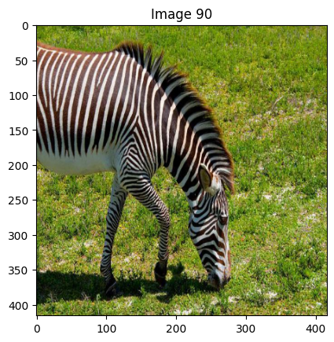

# DINOv2 Image Search (COCO-128)

A demo project for fast similar-image retrieval on the COCO-128 dataset using DINOv2 embeddings and FAISS.

## 📸 Example Results

### Query Image

### Top-5 Similar Images Found

  
  
  
  
  

---

## 🚀 Features

- **DINOv2 Embeddings**: Utilizes Facebook's DINOv2 vision transformer model to generate high-quality image embeddings for accurate image representation
- **FAISS Indexing**: Fast similarity search using Facebook AI Similarity Search (FAISS) with L2 distance metric for efficient vector comparison
- **Efficient Retrieval**: Quick lookup of similar images from the dataset with configurable number of results (k-nearest neighbors)
- **Jupyter Notebook**: Interactive demo in a notebook environment with visualization capabilities
- **COCO Dataset**: Works with the COCO-128 dataset from Roboflow, a subset of the Common Objects in Context dataset
- **GPU Acceleration**: Supports CUDA for faster processing when available, with automatic fallback to CPU

## 🛠️ Technologies

- **PyTorch**: Deep learning framework used for model loading and inference
- **FAISS**: Efficient similarity search and clustering of dense vectors
- **DINOv2**: Self-supervised vision transformer model from Facebook Research
- **Roboflow**: Platform for accessing and managing computer vision datasets
- **Supervision**: Tools for computer vision tasks and visualization
- **Torchvision**: Package consisting of popular datasets, model architectures, and image transformations
- **NumPy**: Library for numerical computations in Python
- **Matplotlib**: Visualization library for creating static, animated, and interactive plots
- **tqdm**: Progress bar utility for visualizing loop progress

## 📋 Implementation Details

The project implements the following workflow:
1. Loads the DINOv2 ViT-S/14 model from PyTorch Hub
2. Downloads the COCO-128 dataset using Roboflow
3. Processes images with appropriate transformations (resize to 224x224, normalization)
4. Extracts 384-dimensional embeddings for each image using DINOv2
5. Creates a FAISS index for fast similarity search
6. Provides a search function to find similar images based on embedding distance
7. Saves embeddings to JSON and index to binary file for later use

## 🔍 Usage

The notebook demonstrates how to:
- Set up the environment with required dependencies
- Load and preprocess images from the COCO-128 dataset
- Create embeddings and build a searchable index
- Perform similarity searches to find visually similar images
- Visualize the results

## ⚖️ License & Attribution  
- **This repo (MIT)** — see LICENSE  
- **DINOv2 (Apache 2.0)** — https://github.com/facebookresearch/dinov2/blob/main/LICENSE  
- **FAISS (BSD-style)** — https://github.com/facebookresearch/faiss/blob/main/LICENSE  
